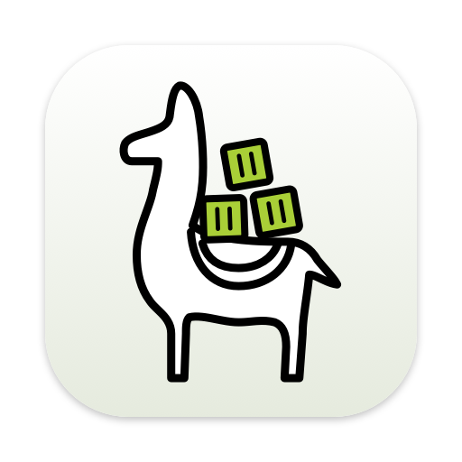
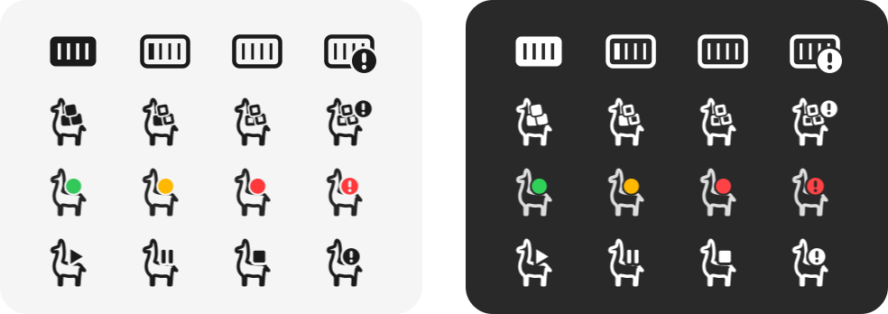

# Colima Desktop



A native macOS menu bar app for [Colima](https://github.com/abiosoft/colima): start, stop and
restart the VM, switch profiles, and manage the containers inside it — logs, an embedded shell,
published ports, start/stop/restart/delete — from one llama in the menu bar.

It talks to Colima through its CLI and to Docker through the Engine API on the profile's unix
socket, so the docker CLI is not needed.

**Site:** <https://mx0r.github.io/colima-desktop/> · **Download:**
[latest release](https://github.com/mx0r/colima-desktop/releases/latest)

<p align="center">
  
  <br>
  <sub>The menu bar icon in its four styles — running, changing, stopped, error — on a light and a
  dark bar. Pick one in Settings.</sub>
</p>

## Features

- **Status** of the selected profile in the icon and the first menu row, with colima's progress
  while an operation runs and a notification when it finishes.
- **Information** submenu: profile, architecture, driver, mount type, allocated CPU/memory/disk,
  live VM usage (load, memory, disks), Docker engine facts and Docker disk usage. Click a row to
  copy its value. Loaded only while the submenu is open.
- **Profile** picker for all Colima profiles.
- **Start, Stop… and Restart…** of the VM. Stop and restart ask first.
- **Containers**, running and stopped, grouped by Compose project. Each container has:
  - details (image, status, ID, created, Compose service, ports),
  - **Logs…** — follow/pause, filter with highlighting, timestamps, stderr in red, markers you
    insert yourself, copy and save,
  - **Terminal…** — an embedded shell in the container,
  - **Open localhost:PORT** for each published TCP port,
  - start, stop… and restart…, and delete… once the container is stopped (volumes and the image
    are kept).
- **Updates** through [Sparkle](https://sparkle-project.org): a daily background check (on by
  default, switchable in Settings), **Check for Updates…** in the menu, and "Update to X…" in the
  menu once a background check finds one — no window steals focus.
- **Settings**: menu bar icon style, launch at login, updates, notifications, refresh interval,
  terminal shell, log sizes, and overrides for everything detected automatically.

### Menu bar icon styles

| Style | Running | Changing | Stopped | Error |
|---|---|---|---|---|
| Container | filled | ribs fill up | outline | badge |
| Llama with cubes (default) | filled cubes | cubes fill up | hollow cubes | badge |
| Llama with status light | green | amber, pulsing | red | red with "!" |
| Llama with play, pause and stop | ▶ | ❚❚ | ■ | badge |

The status light is the one coloured style. macOS strips colour from template images, so it is
drawn for the menu bar's current appearance and redrawn when that changes.

## Requirements

- macOS 26 or later, Apple silicon or Intel.
- Colima (`brew install colima`). Container features need a profile with the Docker runtime,
  which is Colima's default.

To build: Xcode 26, [XcodeGen](https://github.com/yonaskolb/XcodeGen) (`brew install xcodegen`)
and the Metal Toolchain (`xcodebuild -downloadComponent MetalToolchain` — SwiftTerm compiles a
Metal shader, and Xcode 26 ships the compiler separately). Developed against macOS 26.5 and
Xcode 26.4.

## Install

Download the DMG from the [latest release](https://github.com/mx0r/colima-desktop/releases/latest)
and drag Colima Desktop to Applications.

The build is signed ad hoc rather than with an Apple Developer ID, so macOS refuses the first
launch: right-click the app in Applications, choose **Open**, confirm. Once only. If macOS still
refuses, clear the download flag:

```sh
xattr -d com.apple.quarantine /Applications/ColimaDesktop.app
```

## Build and run

```sh
make run          # xcodegen + Debug build + relaunch from .build/
make install      # copy to /Applications and run from there — better for daily use
make test         # unit tests (no colima needed)
make test-live    # plus integration tests against the local colima (default profile running)
make icon         # redraw the app icon from ColimaLlama.swift
make docs-images  # re-render the README and site images from the real drawing code
make release      # test, build Release, sign and package a DMG
```

The first Xcode build asks to trust SwiftTerm's build plugin. Command line builds pass
`-skipPackagePluginValidation`.

Launch at login registers the app's path, so switch it on from the copy in `/Applications`: a
build in `.build/` stops opening once the next build replaces it.

## Settings and detection

Nothing needs configuring. Every value below is detected the way colima itself finds it, and
each can be overridden in Settings.

| Setting | Default (auto-detected) |
|---|---|
| colima executable | `PATH`, then `/opt/homebrew/bin`, `/usr/local/bin`, `/opt/local/bin`, `/run/current-system/sw/bin`, `/usr/bin`, `~/.nix-profile/bin` |
| Colima home | `COLIMA_HOME`, `~/.colima` if it exists, `$XDG_CONFIG_HOME/colima`, `~/.colima` |
| Lima home | `LIMA_HOME`, `<colima home>/_lima` |
| Docker socket | the `docker_socket` that `colima status` reports, else `<colima home>/<profile>/docker.sock` |

Apps started from Finder do not see variables exported in your shell profile. If you use
`COLIMA_HOME` or `LIMA_HOME`, set them in Settings.

## Release

```sh
make release      # or ./scripts/build-release.sh
```

Runs the unit tests, generates the project, builds Release (universal: arm64 and x86_64), signs,
and packages a DMG into `builds/<date>-<version>/` alongside a readme for whoever installs it and
a SHA-256 checksum. `SKIP_TESTS=1` packages without testing, and says so.

Signing defaults to ad hoc. With a Developer ID,
`SIGN_IDENTITY="Developer ID Application: …" ./scripts/build-release.sh` signs with the hardened
runtime and prints the two `notarytool` commands that remove the right-click-to-open step.

### Tagged releases

Pushing a tag builds and publishes the DMG:

```sh
git tag v0.6 && git push origin v0.6
```

`.github/workflows/release.yml` runs the same `scripts/build-release.sh` on a macOS runner and
attaches the DMG, its checksum and the readme to a GitHub release. The version comes from the
tag and the build number from the run number; both reach the app because `Info.plist` resolves
`CFBundleShortVersionString` and `CFBundleVersion` from build settings. No secrets are involved,
because signing is ad hoc.

The workflow has a manual trigger (`workflow_dispatch`) that leaves the DMG as a build artefact
instead of publishing a release.

`.github/workflows/ci.yml` runs the unit tests and a Debug build on every push to `main` and every
pull request.

### Updates (Sparkle)

The app checks `https://github.com/mx0r/colima-desktop/releases/latest/download/appcast.xml`
(`SUFeedURL`). Every release attaches its own `appcast.xml`, and GitHub redirects `latest` to the
newest release, so publishing a release is all it takes. `scripts/make-appcast.sh` signs the DMG
with the update signing key and writes the appcast; it then checks the signature against the
public key inside the app and fails the release on a mismatch. The release workflow refuses to
publish without an appcast.

Code signing stays ad hoc: Sparkle accepts ad-hoc signed updates as long as the EdDSA signature
verifies. Releases before 0.6 have no updater — those installs need one manual update.

### Update signing key

An EdDSA key pair. The **public** key is `SPARKLE_PUBLIC_ED_KEY` in `project.yml` and ships in the
app; it is not a secret. The **private** key signs every release: it lives in your login keychain
(account `colima-desktop`) and in the `SPARKLE_ED_PRIVATE_KEY` repository secret, and nowhere
else.

To create one (and to replace one). The tools are Sparkle's own, pinned with the package — run
`make test` once so they are downloaded:

```sh
SPARKLE_BIN=Packages/ColimaDesktopKit/.build/artifacts/sparkle/Sparkle/bin

# 1. Replacing a key? Remove the old one first — generate_keys reuses an existing key.
security delete-generic-password -s https://sparkle-project.org -a colima-desktop

# 2. Create the pair. The private key goes into the login keychain; macOS may ask to allow it.
"$SPARKLE_BIN/generate_keys" --account colima-desktop

# 3. Print the public key, and set it as SPARKLE_PUBLIC_ED_KEY in project.yml.
"$SPARKLE_BIN/generate_keys" --account colima-desktop -p

# 4. Hand the private key to GitHub straight from the keychain — no file on disk.
security find-generic-password -s https://sparkle-project.org -a colima-desktop -w \
  | gh secret set SPARKLE_ED_PRIVATE_KEY -R mx0r/colima-desktop
```

Then commit `project.yml`, push, and prove the pair matches without publishing anything — the
manual run signs a DMG with the secret and verifies it against the app's public key:

```sh
gh workflow run release.yml -R mx0r/colima-desktop -f version=0.0.0-test
```

Keep a backup in a password manager (`security find-generic-password -s https://sparkle-project.org -a colima-desktop -w`
prints it). If the key is lost, installed copies cannot verify any new update and need one manual
reinstall of a build with the new public key. Rotating a key that installed copies already trust
needs one transition release signed with the old key that carries the new public key.

## Site

`site/` is the landing page — one HTML file, one stylesheet, a few images, no scripts and no
third-party requests. `.github/workflows/pages.yml` publishes it to
<https://mx0r.github.io/colima-desktop/> on every push to `main` that touches it. The download
button points at a specific tagged DMG, so it needs updating when a release goes out.

## How it works

- **Colima** is driven through its CLI: `colima list --json` (one JSON object per profile per
  line), `colima status --json`, `start`/`stop`/`restart`, and `colima ssh` for live VM usage.
  Processes run without a shell; both pipes are drained while they run, so large output cannot
  deadlock them.
- **Docker** is reached over HTTP/1.1 on the profile's unix socket (Network.framework), pinned to
  API v1.44 and checked against the engine at connect time. Logs come as a chunked, multiplexed
  stream that is decoded incrementally; the terminal rides on a hijacked exec connection
  (`101 UPGRADED`). Details in [docs/DOCKER_API.md](docs/DOCKER_API.md).
- **Refreshing** is event-driven: file watches on Colima's directories notice the VM starting and
  stopping, Docker's event stream notices container changes, a heartbeat covers the rest, and
  while the menu is open it refreshes every two seconds.
- **The menu** is built from one immutable snapshot by a pure function and reconciled into
  `NSMenu` items by ID, in place — so it updates while open and an open submenu stays open.
- **Layers** are separate Swift package targets, so the compiler enforces the dependency
  direction: views and view models never see processes or sockets. Details in
  [docs/ARCHITECTURE.md](docs/ARCHITECTURE.md).

Testing, including the manual checklist for what tests cannot reach, is in
[docs/TESTING.md](docs/TESTING.md).

## The icons

The app icon and all menu bar icons are drawn in code from the
[Colima logo](https://github.com/abiosoft/colima/blob/main/colima.png) (MIT License, © 2021
Abiola Ibrahim), redrawn as vector paths in
`Packages/ColimaDesktopKit/Sources/ColimaUI/Branding/ColimaLlama.swift`. At 32 px and below the
app icon drops the cube slits and saddle straps, which only blur at that size. The menu bar
glyphs enlarge the cubes and separate them with a clear gap — without it, three filled cubes merge
into one blob at 18 pt.

Colima Desktop is not affiliated with the Colima project.

## Layout

```
App/                             main.swift, entitlements, asset catalog (Info.plist is generated)
Packages/ColimaDesktopKit/
  Sources/ColimaDomain/          models, lifecycle reducer, ports, settings; Foundation only
  Sources/ColimaInfrastructure/  processes, colima CLI, unix-socket HTTP, Docker client, system services
  Sources/ColimaFeatures/        AppStore, menu model, logs/terminal/settings view models
  Sources/ColimaUI/              status item, menu renderer, icons, windows, SwiftUI views
  Sources/ColimaTerminal/        SwiftTerm bridge
  Sources/ColimaUpdates/         Sparkle updater
  Sources/ColimaAppShell/        composition root
  Tests/                         one target per layer, plus live integration tests
scripts/                         build-release.sh, make-appcast.sh, generate-app-icon.sh
site/                            landing page
docs/                            architecture, Docker API, testing; README images
```

## License

[MIT](LICENSE). Third-party notices are in [THIRD_PARTY_NOTICES.md](THIRD_PARTY_NOTICES.md); the
released DMG includes both.
